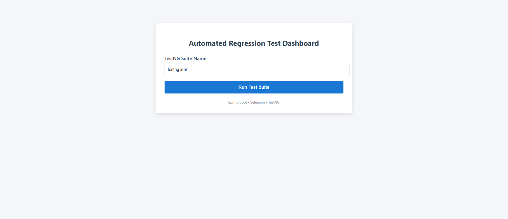

# 🚀 Automation Test Execution Framework
A Java-based automation test execution framework to manage, execute, and monitor automated Selenium test suites with a simple UI for results and execution control.

---

## 📋 Table of Contents
- [About the Project](#about-the-project)
- [Technology Stack](#technology-stack)
- [Project Folder Structure](#project-folder-structure)
- [Folder Descriptions](#folder-descriptions)
- [POM.xml Explanation](#pomxml-explanation)
- [How to Run the Project](#how-to-run-the-project)

---

## 🔍 About the Project
The Automation Test Execution framework is a Java-based application developed to manage, execute, and monitor automated test cases efficiently. It provides a centralized platform for running Selenium test scripts and viewing execution results.

## 🧰 Technology Stack

| Technology   | Version | Purpose                  |
|--------------|---------|--------------------------|
| **Java**     | 21      | Programming Language     |
| **Spring Boot** | 4.x  | Backend Framework        |
| **Selenium** | 4.x     | Test Automation          |
| **TestNG**   | 7.x     | Testing Framework        |
| **Thymeleaf**| 3.x     | Frontend Template Engine |
| **Maven**    | 3.x     | Build Tool               |


## 📁 Project Folder Structure

├── src/
│   ├── main/
│   │   ├── java/
│   │   │   └── com/milestone/four/
│   │   │                      ├── controller/
│   │   │                      ├── herokuapp/
│   │   │                      ├── listener/
│   │   │                      ├── orangehrm/
|   |   |                      ├── runner/
│   │   │                      ├── service/
│   │   │                      ├── utility/
│   │   │                      └── AutomationApplication.java
│   │   |         
│   │   │
│   │   └── resources/
│   │       ├── templates/
│   │       │   ├── dashboard.html
│   │       │   
│   │       ├── static/
|   |       |     ├── style.css
│   │       └── application.properties
|   |            └── config.properties
|   |            └── testng.xml
|   |            └── testng1.xml
│   │
│   └── test/
│       └── java/
│           └── com/milestone/tests/
│
├── pom.xml
└── README.md

## 🗂️ Folder Descriptions
- **controller** → Handles web requests and UI navigation
- **service** → Manages test execution logic
- **runner** → Executes Selenium and TestNG test suites
- **config** → Application and framework configurations
- **templates** → Thymeleaf UI pages


## 🧩 POM.xml Explanation

**Spring Boot Starter Web** — Used to create REST APIs and backend services.
```xml
<dependency>
  <groupId>org.springframework.boot</groupId>
  <artifactId>spring-boot-starter-web</artifactId>
</dependency>
```

**Spring Boot Starter Thymeleaf** — Used for building dynamic frontend pages.
```xml
<dependency>
  <groupId>org.springframework.boot</groupId>
  <artifactId>spring-boot-starter-thymeleaf</artifactId>
</dependency>
```

**Selenium WebDriver** — Used for browser automation.
```xml
<dependency>
  <groupId>org.seleniumhq.selenium</groupId>
  <artifactId>selenium-java</artifactId>
</dependency>
```

**TestNG** — Used for test execution and reporting.
```xml
<dependency>
  <groupId>org.testng</groupId>
  <artifactId>testng</artifactId>
</dependency>
```

**Spring Boot Starter Test** — Used for unit and integration testing.
```xml
<dependency>
  <groupId>org.springframework.boot</groupId>
  <artifactId>spring-boot-starter-test</artifactId>
</dependency>
```

**Maven Surefire Plugin** — Used to run TestNG tests.
```xml
<plugin>
  <groupId>org.apache.maven.plugins</groupId>
  <artifactId>maven-surefire-plugin</artifactId>
</plugin>
```

## ▶️ How to Run the Project
1. **Clone the repository**

```bash
git clone <your-repository-url>
cd automation-test-execution-framework
```

2. **Build the project**

```bash
mvn clean install
```

3. **Run the application**

```bash
mvn spring-boot:run
```

4. **Open the application in your browser**

```
http://localhost:8082/ui/dashboard
```

> Note: Two TestNG files are present in the resources: `testng.xml` and `testng1.xml`.

---

## Screenshot




